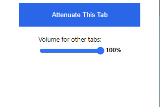
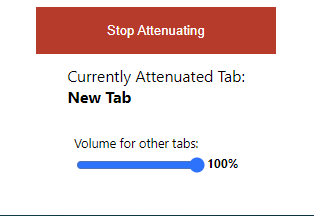

# Browser Tab Attenuator

#### **at·ten·u·a·tion (əˌtenyo͝oˈāSH(ə)n)**
##### noun
*the reduction of the force, effect, or value of something.*

## What does this extension do?
Pick any tab and attenuate all other tabs - pick a volume and they will be lowered to it!.

### Known Issues
- Currently only supports Google Chrome.
- Spamming the attenuation button can cause browser slowness.

