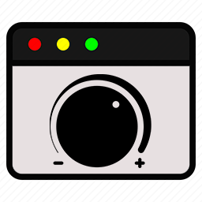

# Browser Tab Attenuator

### **at·ten·u·a·tion (əˌtenyo͝oˈāSH(ə)n)**
#### noun
*the reduction of the force, effect, or value of something.*

## What does this extension do?
Pick any tab and attenuate all other tabs - pick a volume and they will be lowered to it!.

## Installation
Until this gets posted on the Chrome extension store, The only way to load this extension is through the `chrome://extensions` URL:
1. Enter `chrome://extensions` into the URL bar.
2. Enable **Developer Mode** in the top right corner.
3. Click on the **Load Unpacked** button in the top left corner.
4. Select the folder containing this extension.
5. Ensure the extension is installed by going to the extension toolbar (to the right of the URL bar).

### Known Issues
- Currently only supports Google Chrome.
- Spamming the attenuation button can cause browser slowness.

